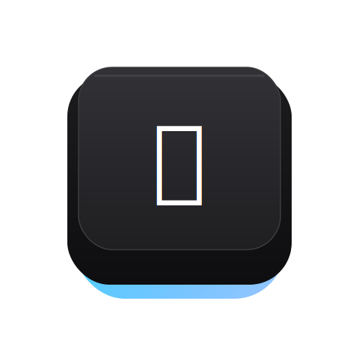

#  FlowTyping

> **FlowTyping** is a premium, fluid, and highly customizable online typing simulation and IME learning environment. Built using Svelte 5, TypeScript, and TailwindCSS, it models a realistic mechanical keyboard typing experience and custom IME (Input Method Editor) composition.

---

## Core Features

### 1. Dual Keyboard Layout Engine
* **Taiwan Zhuyin (Bopomofo) Mode**: Integrated custom phonetic engine supporting **smart continuous sentence typing** (composition buffer).
  * **Continuous Input**: Type entire sentences continuously without early confirmation. Text is held in the composition buffer and rendered with a dashed underline.
  * **Enter to Commit**: Confirm and commit the entire composition sentence by pressing `Enter`.
  * **Up to Select Candidates**: Press `ArrowUp` to open the candidate list for the character immediately to the left of the cursor. Pressing `Enter` or a number key confirms/commits the selected candidate and closes the list, keeping the rest of the sentence uncommitted.
  * **Cursor Navigation**: Full support for moving the cursor inside the composition buffer using Left/Right arrows or mouse clicks to edit phonetic keys or select candidates.
* **English (US QWERTY) Mode**: A layout-independent typing capture system using physical keycodes (`e.code`), ensuring correct English character input regardless of your local operating system's keyboard layout. Fully simulates physical CapsLock and Shift XOR logic.

### 2. High-Fidelity Customization & Aesthetics
* **Dynamic Presets**: Swap between beautifully crafted presets such as *Cyber Cyan, Charcoal Dark, Charcoal Light, Retro Mechanical, Vintage Beige, Wood Grain,* and *Sakura Pink*.
* **Interactive RGB Lighting**: Enable dynamic multi-color RGB borders and breathing glow backlights under keycaps.
* **Adjustable Typography**: Supports setting system scale and typing text area sizes dynamically from `6 pt` to `32 pt` (obeying standard spacing guidelines).
* **Collapsible Options Panel**: Personalization drawer with scroll overflow safety and a custom webkit scrollbar.

### 3. Checkbox-Based Hotkey Configurations
* Configure your own layout switching shortcut in the **Advanced Settings** menu (collapsible via arrow toggle).
* Select combinations of keys using checkboxes: `Ctrl`, `Space`, `Shift`, `Caps Lock`, `Tab`, `Alt`, `L-Ctrl`, `R-Ctrl`, `L-Shift`, and `R-Shift`.
* Supports **smart modifier-only release** (e.g. smart short Shift press check) and instant **multi-key combinations** (e.g. `Ctrl + Space` or `L-Ctrl + Tab`) with automatic browser input suppression.

### 4. Segregated Emoji & Special Symbols Picker
* Independent tab panels separating graphic **Emojis** from technical **Symbols** (Greek letters, mathematical operators, and special shapes).

### 5. Convenient Utilities
* **Auto CJK Spacing**: Toggleable **pangu.js** integration in Advanced Settings. Automatically inserts correct spacing between Chinese and Western alphanumeric characters with smart cursor offset tracking.
* **Word Counter**: Real-time character/word tracker positioned at the bottom-left of the typing zone, with extra scroll bottom-padding to prevent layout overlap.
* **Copy/Clear Buttons**: Quick actions to copy typed text to clipboard or clear the input area.
* **Bilingual UI & SVG Brand Assets**: Full internationalization (i18n) support for both **繁體中文** and **English**, coupled with a crisp, custom SVG keycap logo serving as favicon and header brand identity.

---

## Tech Stack & Architecture

* **Frontend**: [Svelte 5](https://svelte.dev/) (utilizing reactive states)
* **Language**: [TypeScript](https://www.typescriptlang.org/)
* **Styles**: [TailwindCSS](https://tailwindcss.com/) with responsive glassmorphism and modern dark-mode aesthetics
* **Bundler**: [Vite](https://vite.dev/)
* **Zhuyin Parser**: Custom state machine translating raw keyboard input to phonetics and candidate weights.

---

## Getting Started

### Prerequisites
Make sure you have Node.js and `pnpm` installed on your system.

### Installation
Clone the repository and install the dependencies:
```bash
pnpm install
```

### Run Locally (Development Server)
Launch the local hot-reloading development server:
```bash
pnpm dev
```
Open [http://localhost:5173](http://localhost:5173) in your browser.

### Build for Production
To bundle the application for production deployment:
```bash
pnpm build
```
The production bundle will be built in the `dist/` directory.

### Code Checks & Linting
Validate TypeScript and Svelte components for correctness:
```bash
pnpm check
```

---

## License
This project is open-source and available under the [GNU General Public License v3.0](LICENSE).

---

## Appendix
* [Chinese Copywriting Guidelines](https://github.com/sparanoid/chinese-copywriting-guidelines)
* **Open Data Attribution / 開放資料來源標示**：Zhuyin Mapping Database (`public/dict.json` & `src/engine/DEFAULT_DICT`)
  <details>
  <summary>Click to view license details / 點擊展開詳細聲明</summary>
  <br>

  * **Source**: [Chinese National Standard (CNS11643)](http://www.cns11643.gov.tw/)
  * **License**: [Open Government Data License v1.0](https://data.gov.tw/license)
  * **Conversion**: Extracted to `.cin` by Zhao Weilun (bluebat) in 2007.
  * **Attribution**: Intellectual property belongs to the original government agency. Distributed under the Open Government Data License.

  *(繁體中文版)*
  * **資料來源**：[中華民國國家標準中文交換碼 (CNS11643)](http://www.cns11643.gov.tw/)
  * **授權條款**：[政府開放資料授權條款 - 第 1.0 版](https://data.gov.tw/license)
  * **格式轉換**：由趙惟倫 (bluebat) 於 2007 年整理並轉換為 `.cin` 格式。
  * **版權聲明**：原始資料之智慧財產權歸屬原提供機關，本專案依開放資料條款進行重製與散布。

  </details>